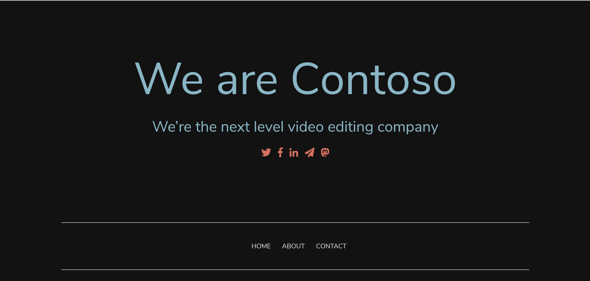

Azure Kubernetes Cluster
Hands-on lab  
November 2021

<br />

**Prerequisites**

- Azure Subscription を保有していること
- Azure CLI を使用可能であること（Cloud Shell でも可）

**Contents**

## **1. Azure Kubernetes クラスターの作成**

- 環境変数定義

```bash
$ export RESOURCE_GROUP=AKS-Hands-on-Lab
$ export CLUSTER_NAME=aks-contoso-video
```

- AKS クラスターの作成

```bash
$ az aks create \
    --resource-group $RESOURCE_GROUP \
    --name $CLUSTER_NAME \
    --node-count 2 \
    --enable-addons http_application_routing \
    --generate-ssh-keys \
    --node-vm-size Standard_B2s \
    --network-plugin azure
```

- ノードプールの追加

```bash
$ az aks nodepool add \
    --resource-group $RESOURCE_GROUP \
    --cluster-name $CLUSTER_NAME \
    --name userpool \
    --node-count 2 \
    --node-vm-size Standard_B2s
```

- 資格情報取得

```bash
$ az aks get-credentials --name $CLUSTER_NAME --resource-group $RESOURCE_GROUP
$ cat ~/.kube/config
```

- クラスターに接続できることを確認

```bash
$ kubectl get nodes

NAME                                STATUS   ROLES   AGE     VERSION
aks-nodepool1-33081063-vmss000000   Ready    agent   11m     v1.20.9
aks-nodepool1-33081063-vmss000001   Ready    agent   11m     v1.20.9
aks-userpool-33081063-vmss000000    Ready    agent   2m33s   v1.20.9
aks-userpool-33081063-vmss000001    Ready    agent   2m17s   v1.20.9
```

## **2. アプリケーションのデプロイ**

- マニフェストファイルの作成

```bash
$ touch deployment.yaml
$ code .
```

- 以下のコードセクションを追記

```bash
# deployment.yaml
apiVersion: apps/v1
kind: Deployment
metadata:
  name: contoso-website
spec:
  selector: # Define the wrapping strategy
    matchLabels: # Match all pods with the defined labels
      app: contoso-website # Labels follow the `name: value` template
  template: # This is the template of the pod inside the deployment
    metadata:
      labels:
        app: contoso-website
    spec:
      nodeSelector:
        kubernetes.io/os: linux
      containers:
        - image: mcr.microsoft.com/mslearn/samples/contoso-website
          name: contoso-website
          resources:
            requests:
              cpu: 100m
              memory: 128Mi
            limits:
              cpu: 250m
              memory: 256Mi
          ports:
            - containerPort: 80
              name: http
```

- Pod がラップされていることを確認

```bash
$ kubectl apply -f ./deployment.yaml
$ kubectl get pods

NAME                             READY   STATUS    RESTARTS   AGE
contoso-website-97988f7c-nf8f9   1/1     Running   0          55s

$ kubectl describe pods
Name:         contoso-website-97988f7c-nf8f9
Namespace:    default
Priority:     0
・・・
```

## **3. アプリケーションへのネットワークアクセスを有効化**

- Service マニフェストファイルの作成

```bash
$ touch service.yaml
$ code .
```

- 以下のコードセクションを追記

```bash
#service.yaml
apiVersion: v1
kind: Service
metadata:
  name: contoso-website
spec:
  type: ClusterIP
  selector:
    app: contoso-website
  ports:
    - port: 80 # SERVICE exposed port
      name: http # SERVICE port name
      protocol: TCP # The protocol the SERVICE will listen to
      targetPort: http # Port to forward to in the POD
```

- Service のデプロイ

```bash
$ kubectl apply -f ./service.yaml
$ kubectl get service contoso-website

NAME              TYPE        CLUSTER-IP    EXTERNAL-IP   PORT(S)   AGE
contoso-website   ClusterIP   10.0.40.132   <none>        80/TCP    8s
```

- Ingress マニフェストファイルの作成

```bash
$ touch ingress.yaml
$ code .
```

- クラスターへのアクセスが許可されるホストの FQDN の設定

```bash
az aks show \
  -g $RESOURCE_GROUP \
  -n $CLUSTER_NAME \
  -o tsv \
  --query addonProfiles.httpApplicationRouting.config.HTTPApplicationRoutingZoneName

6fa7a55d2bdb41b9a199.westus2.aksapp.io
```

- 以下のコードセクションを追記

```bash
#ingress.yaml
apiVersion: networking.k8s.io/v1
kind: Ingress
metadata:
  name: contoso-website
  annotations:
    kubernetes.io/ingress.class: addon-http-application-routing
spec:
  rules:
    - host: contoso.<zone-name> # Which host is allowed to enter the cluster
      http:
        paths:
          - backend: # How the ingress will handle the requests
              service:
               name: contoso-website # Which service the request will be forwarded to
               port:
                 name: http # Which port in that service
            path: / # Which path is this rule referring to
            pathType: Prefix # See more at https://kubernetes.io/docs/concepts/services-networking/ingress/#path-types    
```

- Ingress のデプロイ

```bash
$ kubectl apply -f ./ingress.yaml
$ kubectl get ingress contoso-website

NAME              CLASS    HOSTS                                            ADDRESS          PORTS   AGE
contoso-website   <none>   contoso.6fa7a55d2bdb41b9a199.westus2.aksapp.io   20.115.168.210   80      2m9s
```

- 接続確認

```bash
$ curl -LI contoso.6fa7a55d2bdb41b9a199.westus2.aksapp.io -o /dev/null -w '%{http_code}\n' -s

200
```

- ブラウザからも接続



## **4. AKS ノードにおけるコンピューティングコストの最適化**

- **ノードプールの手動スケーリング**

特定の間隔で特定の期間にわたって実行されるワークロードを実行している場合、ノード プールのサイズを手動でスケーリングするのが、ノードのコストを制御する方法です。

```bash
$ az aks nodepool scale \
    --resource-group $RESOURCE_GROUP \
    --cluster-name $CLUSTER_NAME \
    --name userpool \
    --node-count 0
```

- ノード一覧を取得

```bash
$ kubectl get nodes

NAME                                STATUS   ROLES   AGE   VERSION
aks-nodepool1-33081063-vmss000000   Ready    agent   50m   v1.20.9
aks-nodepool1-33081063-vmss000001   Ready    agent   50m   v1.20.9
```

- **スポットノードプールの活用**

- サブスクリプションにて `spotpoolpreview` 機能を有効化

```bash
$ az feature register --namespace "Microsoft.ContainerService" --name "spotpoolpreview"
$ az feature list -o table --query "[?contains(name, 'Microsoft.ContainerService/spotpoolpreview')].{Name:name,State:properties.state}"
$ az provider register --namespace Microsoft.ContainerService
```

- aks-preview CLI インストール

```bash
$ az extension add --name aks-preview
```

- スポットノードプールを AKS クラスターに追加

```bash
$ az aks nodepool add \
    --resource-group $RESOURCE_GROUP \
    --cluster-name $CLUSTER_NAME \
    --name spotpool01 \
    --enable-cluster-autoscaler \
    --max-count 3 \
    --min-count 1 \
    --priority Spot \
    --eviction-policy Delete \
    --spot-max-price -1 \
    --no-wait
```

- スポットノードプールの確認

```bash
$ az aks nodepool show \
    --resource-group $RESOURCE_GROUP \
    --cluster-name $CLUSTER_NAME \
    --name spotpool01

{
・・・
  "enableAutoScaling": true,
・・・
  "maxCount": 3,
  "maxPods": 30,
  "minCount": 1,
・・・
  "scaleSetEvictionPolicy": "Delete",
  "scaleSetPriority": "Spot",
  "spotMaxPrice": -1.0,
・・・
}
```

- Pod をスポットノードプールにデプロイ

```bash
$ touch spot.yaml
$ code .
```

- 以下のコードセクションを追記

```bash
apiVersion: v1
kind: Pod
metadata:
  name: nginx
  labels:
    env: test
spec:
  containers:
  - name: nginx
    image: nginx
    imagePullPolicy: IfNotPresent
  tolerations:
  - key: "kubernetes.azure.com/scalesetpriority"
    operator: "Equal"
    value: "spot"
    effect: "NoSchedule"
```

- スポットノードプールにアプリケーションをデプロイ

```bash
$ kubectl apply -f spot.yaml
```

- 確認

```bash
$ kubectl get pods -o wide

NAME                             READY   STATUS    RESTARTS   AGE   IP             NODE                                 NOMINATED NODE   READINESS GATES
contoso-website-97988f7c-png52   1/1     Running   0          44m   10.240.0.59    aks-nodepool1-33081063-vmss000001    <none>           <none>
nginx                            1/1     Running   0          15s   10.240.0.105   aks-spotpool01-33081063-vmss000001   <none>           <none>
```

- **Kubernetes 用の Azure Policy を構成**

- 以下のリソースプロバイダーを登録

    - Azure Kubernetes Service
    - Azure Policy

```bash
$ az provider register --namespace Microsoft.ContainerService
$ az provider register --namespace Microsoft.PolicyInsights
```

- アドオンのインストールを有効化

```bash
$ az feature register --namespace Microsoft.ContainerService --name AKS-AzurePolicyAutoApprove
$ az feature list -o table --query "[?contains(name, 'Microsoft.ContainerService/AKS-AzurePolicyAutoApprove')].   {Name:name,State:properties.state}"
$ az provider register -n Microsoft.ContainerService
```

- **Azure Policy アドオンの有効化**

```bash
$ az aks enable-addons \
    --addons azure-policy \
    --name $CLUSTER_NAME \
    --resource-group $RESOURCE_GROUP
```

- kube-system 名前空間に azure ポリシー ポッドがインストールされていること、および gatekeeper-system 名前空間にゲートキーパー ポッドがインストールされていることを確認

```bash
$ kubectl get pods -n kube-system

azure-policy-66489c49db-427vw                                     1/1     Running   0          24m
azure-policy-webhook-7bf799979b-vbrrz                             1/1     Running   0          24m

$ kubectl get pods -n gatekeeper-system

gatekeeper-audit-6fccbf6649-hft6b        1/1     Running   0          25m
gatekeeper-controller-68dbf74b86-kqqnr   1/1     Running   0          25m
gatekeeper-controller-68dbf74b86-wtbq4   1/1     Running   0          25m
```

- 最新のアドオンがインストールされていることを確認

```bash
$ az aks show \
 --resource-group $RESOURCE_GROUP\
 --name $CLUSTER_NAME \
 -o table --query "addonProfiles.azurepolicy.config.version"
```
- **組み込みのポリシー割り当てを実施**

新しい Azure Policy を構成するには、Azure portal の `ポリシー` サービスを使用します。

- [Azure Portal](https://portal.azure.com/)にログイン

- ポータルの上部にある検索バーで、**ポリシー** を検索して選択

- 左側のメニュー ペインの `作成` で、`割り当て` を選択

- 上部のメニュー バーで、`ポリシーの割り当て` を選択

- `基本` タブで、各設定に次の値を入力

| 設定 | 値 |
| :--- | :--- |
|スコープ	|
|Scope | 省略記号ボタンを選択します。`スコープ` ペインが表示されます。 `サブスクリプション` で、自分のリソース グループが保持されているサブスクリプションを選択します。 `リソース グループ` で、ハンズオンで使用しているリソースグループを選んでから `選択` を選択します。 |
| 除外 | 空のままにします。|
|基本操作	|
|ポリシー定義 | 省略記号ボタンを選択します。 `使用可能な定義` ペインが表示されます。 `検索` ボックスに、**CPU**と入力して選択項目を絞り込みます。 `ポリシー定義` タブで、`Kubernetes cluster containers CPU and memory resource limits should not exceed the specified limits(Kubernetes クラスター コンテナーの CPU およびメモリ リソースの制限が指定された制限を超えないようにする)`を選択します。 その後、`選択` を選択します。|
| 割り当て名 | 既定値をそのまま使用します。|
|Description | 空のままにします。|
| ポリシーの適用 | このオプションが `有効` に設定されていることを確認します。|
| 割り当て担当者 | 既定値をそのまま使用します。|

- `パラメーター` タブで、各設定に次の値を入力

| 設定 | 値 |
| :--- | :--- |
| 許可される CPU ユニットの最大数 | 値を **200m** に設定します。 この値は、ポリシーにより、ワークロードのマニフェスト ファイルに指定した、ワークロードのリソース要求値とワークロードの制限値の両方に照合されます。|
| 許可されるメモリの最大バイト数 | 値を **256Mi** に設定します。 この値は、ポリシーにより、ワークロードのマニフェスト ファイルに指定した、ワークロードのリソース要求値とワークロードの制限値の両方に照合されます。|

- `修復`タブは既定のままとする

```bash
$ code policy.yaml
```

以下のコードセクションを追記

```bash
apiVersion: v1
kind: Pod
metadata:
  name: nginx
  labels:
    env: test
spec:
  containers:
  - name: nginx
    image: nginx
    imagePullPolicy: IfNotPresent
    resources:
      requests:
        cpu: 500m
        memory: 256Mi
      limits:
        cpu: 1000m
        memory: 500Mi
```

- Pod のデプロイを試みると、エラーが返ってくることを確認

```bash
$ kubectl delete pod nginx
$ kubectl apply -f policy.yaml

```

- マニフェストファイルを以下のように修正

```bash
apiVersion: v1
kind: Pod
metadata:
  name: nginx
  labels:
    env: test
spec:
  containers:
  - name: nginx
    image: nginx
    imagePullPolicy: IfNotPresent
    resources:
      requests:
        cpu: 200m
        memory: 256Mi
      limits:
        cpu: 200m
        memory: 256Mi
```

- Pod をデプロイ

```bash
$ kubectl apply -f policy.yaml
$ kubectl get pods
```

## **5. Helm を使用したアプリケーションとパッケージ管理**

